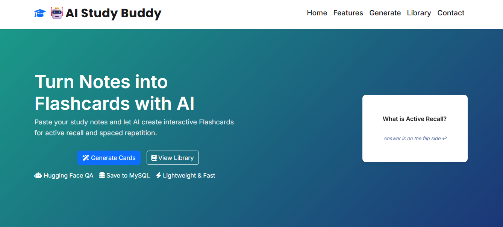
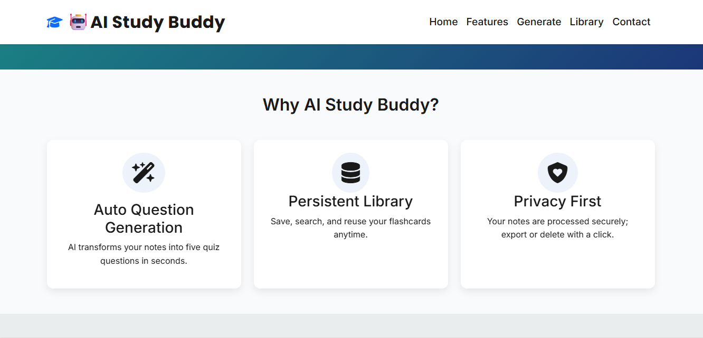
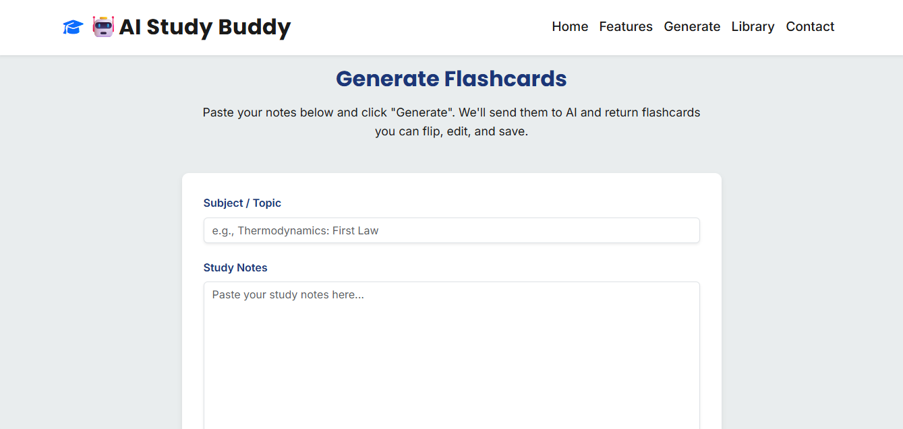
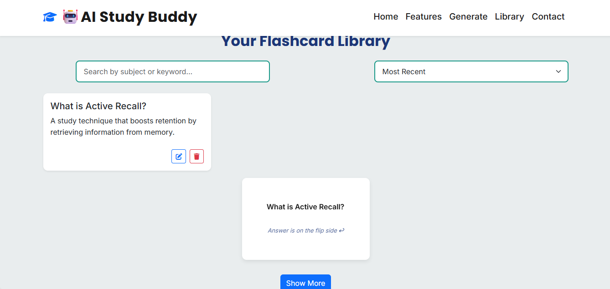
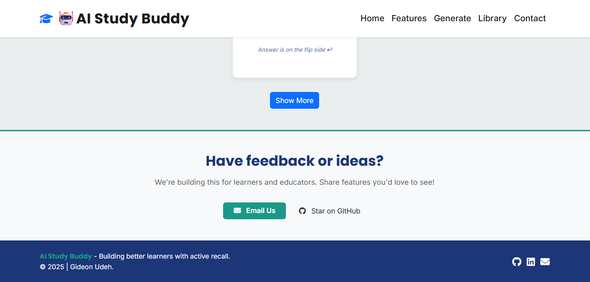
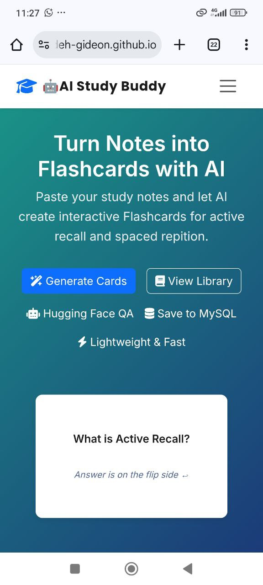
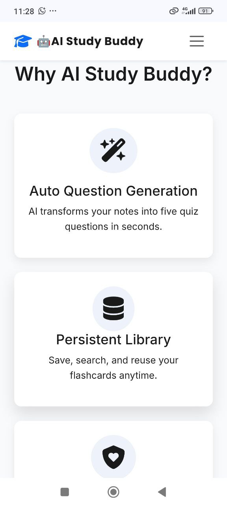
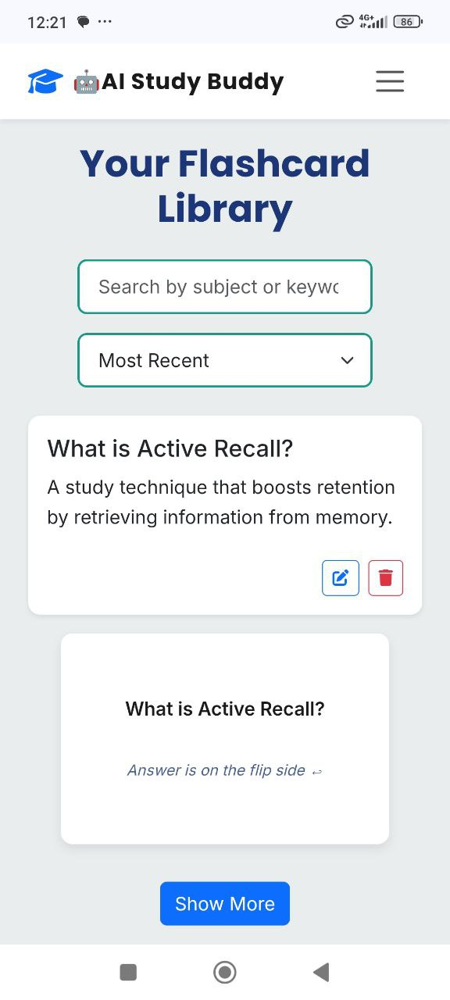

# 🤖📚 AI Study Buddy – Flashcard Generator

## 🚀 Overview

AI Study Buddy is an interactive flashcard generator designed to enhance learning through active recall. By leveraging AI and simple web technologies, it empowers students to turn their study notes into quiz-style flashcards instantly—making learning more engaging, accessible, and effective.

This project directly contributes to SDG 4 – Quality Education, by providing innovative tools for students, especially those in resource-constrained environments.

---

## 🔍 Problem Statement

Students often struggle with traditional study methods, which can be passive and ineffective. Manual flashcard creation is time-consuming, discouraging learners from using active recall techniques that are proven to boost memory retention.

---

## 💡 Solution

AI Study Buddy automates the creation of flashcards from raw study notes. By integrating Hugging Face’s Question-Answering API, it generates quiz questions instantly and displays them as interactive flip-cards. Students can store and reuse their flashcards, making revision simple, efficient, and fun.

## ✨ Key Features
- 📝 Smart Note Input: Paste any study notes into the system.

- 🤖 AI-Powered Questions: Hugging Face API generates 5 quiz questions.

- 🎴 Interactive Flashcards: HTML, CSS, and JS create animated flip cards.

- 💾 Persistence: Flashcards are stored in MySQL for future use.

- 🔁 Reusable Learning: Students can revisit flashcards anytime.

---

## 🌍 Market Insight

The project is designed for:

- Students: Seeking interactive and effective revision methods.

- Educators: Wanting to make learning more engaging without complex tools.

- EdTech Innovators: Exploring lightweight AI integrations for learning apps.

By combining accessibility with AI, the tool bridges the gap for learners in under-resourced communities.

---

## 🛠️ Tech Stack
**Frontend**:
- HTML5 (cards)

- CSS3 (animations)

- JavaScript (flip card logic + state management)

**Backend**:

- Python (Flask)

- MySQL (store flashcards)

**AI**:

- Hugging Face Question-Answering API

## ⚡ How It Works

1. ✍️ User pastes study notes (textarea in HTML → Flask).

2. 🔗 Flask sends text to Hugging Face API: “Generate 5 quiz questions”.

3. 🎴 JS dynamically generates interactive flashcards.

4. 💾 Flashcards stored in MySQL for reuse.

---

## 📸 Screenshots


*This is the display of the Hero Section on Desktop view*


*This is the display of the Features Section on Desktop view*


*This is the display of the Generator Section on Desktop view*


*This is the display of the Flashcard Library Section on Desktop view*


*This is the display of the CTA-Footer Section on Desktop view*


*This is the display of the Hero Section on Mobile view*


*This is the display of the Features Section on Mobile view*


*This is the display of the Generator Section on Mobile view*


*This is the display of the Flashcard Library Section on Mobile view*


*This is the display of the CTA-Footer Section on Mobile view*
---

## 🚀 Getting Started

**Prerequisites**

- Python 3.x
- Flask
- MySQL
- Hugging Face API Key

**Setup**

```bash
# Clone repo
git clone https://github.com/udeh-gideon/ai-study-buddy-hackathon.git

# Navigate into project
cd ai-study-buddy-hackathon

# Install dependencies
pip install -r requirements.txt

# Run server
python app.py
```

---

## View Live Demo via the link below: 
[https://udeh-gideon.github.io/ai-study-buddy-hackathon/] to start generating flashcards.

---

## 🏆 Hackathon Criteria Alignment

- ✅ Problem Clarity: Solves the challenge of passive study methods.

- ✅ Solution Quality: Innovative flashcard generator powered by AI.

- ✅ Market Insight: Tailored for students, teachers, and EdTech innovators.

---

## 🤝 Contributors
- Gideon Udeh - Project Lead, Developer.
- ChatGPT - my awesome coding assistant!